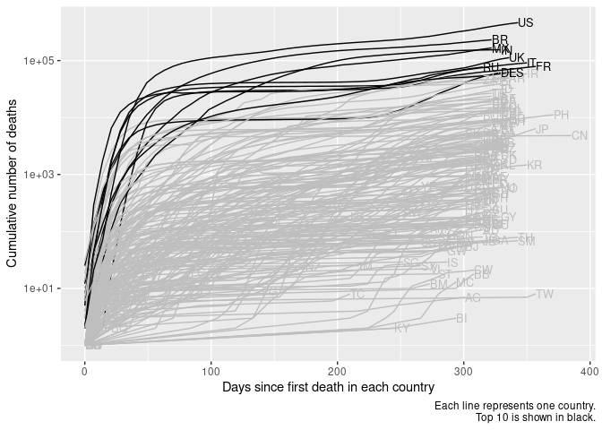
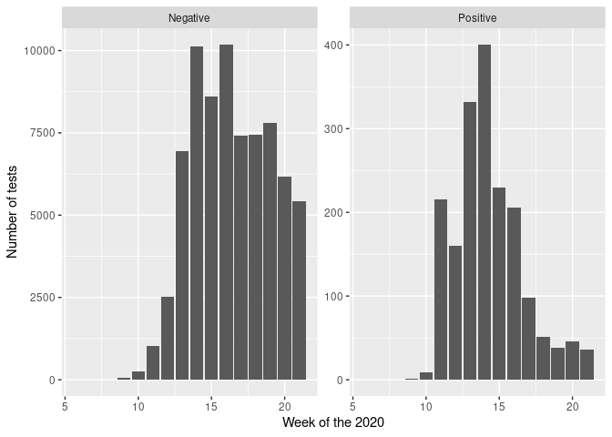
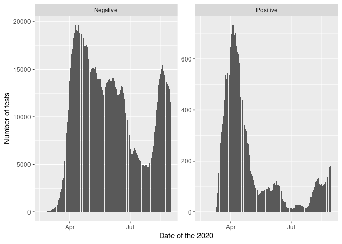
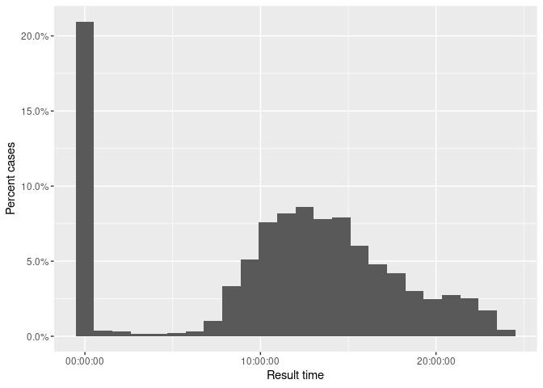

# COVID-19 cases and deaths

rstats-tartu  
last update: 2020-04-12 15:27:06

## Dataset

Daily COVID-19 data is from [European Centre for Disease Prevention and
Control](https://www.ecdc.europa.eu/en/publications-data/download-todays-data-geographic-distribution-covid-19-cases-worldwide).

## Setting up data

Loading
libraries.

``` r
pkg <- c("dplyr", "tidyr", "readr", "lubridate", "here", "ggplot2", "directlabels")
invisible(lapply(pkg, library, character.only = TRUE))
```

Importing downloaded ECDC daily COVID-19 dataset.

``` r
path <- here("data/COVID-19-geographic-distribution-worldwide.csv")
covid <- read_csv(path, col_types = cols(daterep = col_date(format = "%d/%m/%Y")))
```

Resetting timeline to days since first case in each country.

``` r
covid_by_country <- covid %>% 
  filter(cases != 0, deaths != 0) %>% 
  group_by(country) %>% 
  mutate(tp = interval(Sys.Date(), daterep) / ddays(1),
         tp = tp - min(tp))
```

Calculating number of cases and deaths per country. Keeping only
informative rows.

``` r
lag_n <- 7
covid_cum <- covid_by_country %>% 
  mutate(cum_cases = with_order(tp, cumsum, cases),
         cum_deaths = with_order(tp, cumsum, deaths),
         risk = cum_deaths / cum_cases,
         risk_lag = cum_deaths / lag(cum_cases, n = lag_n, order_by = tp)) %>% 
  ungroup()
```

## Worldwide cases and deaths

COVID-19 cases worldwide.

``` r
covid_cum %>% 
  ggplot(aes(daterep, cum_cases, group = country)) +
  geom_line() +
  geom_dl(aes(label = geoid), method = list("first.points", cex = 0.8)) +
  scale_y_log10() +
  labs(x = "Date", 
       y = "Cumulative number of cases",
       caption = "Each line represents one country")
```

<!-- -->

COVID-19 deaths worldwide.

``` r
covid_cum %>% 
  ggplot(aes(daterep, cum_deaths, group = country)) +
  geom_line() +
  geom_dl(aes(label = geoid), method = list("first.points", cex = 0.8)) +
  scale_y_log10() +
  labs(x = "Date", 
       y = "Cumulative number of deaths",
       caption = "Each line represents one country")
```

<!-- -->

## Cases and deaths on relative time scale

Number of cases per country.

``` r
covid_cum %>% 
  ggplot(aes(tp, cum_cases, group = country)) +
  geom_line() +
  geom_dl(aes(label = geoid), method = list("last.points", cex = 0.8)) +
  scale_y_log10() +
  labs(x = "Days since first case in each country", 
       y = "Cumulative number of cases",
       caption = "Each line represents one country")
```

<!-- -->

Number of deaths per country.

``` r
covid_cum %>% 
  ggplot(aes(tp, cum_deaths)) +
  geom_line(aes(group = country)) +
  geom_dl(aes(label = geoid), method = list("last.points", cex = 0.8)) +
  scale_y_log10() +
  labs(x = "Days since first death in each country", 
       y = "Cumulative number of deaths",
       caption = "Each line represents one country")
```

<!-- -->

## Risk of death

``` r
covid_cum %>% 
  ggplot(aes(tp, risk)) +
  geom_line(aes(group = country)) +
  geom_dl(aes(label = geoid), method = list("last.points", cex = 0.8)) +
  scale_y_log10() +
  labs(x = "Time, days from first case", 
       y = "Risk of death",
       caption = "Each line represents one country")
```

<!-- -->

Lagged (7 days) risk. Risk of death relative to number of cases 7 days
earlier.

``` r
covid_cum %>% 
  ggplot(aes(tp, risk_lag)) +
  geom_line(aes(group = country)) +
  geom_dl(aes(label = geoid), method = list("last.points", cex = 0.8)) +
  scale_y_log10() +
  labs(x = "Time, days from first case", 
       y = "Risk of death",
       caption = "Each line represents one country")
```

<!-- -->

Cases in Estonia

``` r
est <- read_csv(here("data/opendata_covid19_test_results.csv"))
est <- est %>% 
  mutate(result_wk = isoweek(ResultTime),
         ResultDate = date(ResultTime))
```

Number of cases per week.

``` r
est %>% 
  count(result_wk, ResultValue) %>% 
  mutate(ResultValue = case_when(
    ResultValue == "N" ~ "Negative",
    ResultValue == "P" ~ "Positive"
  )) %>% 
  ggplot() +
  geom_col(aes(result_wk, n)) +
  facet_wrap(~ ResultValue, scales = "free_y") +
  scale_x_continuous(breaks = scales::pretty_breaks()) +
  labs(x = "Week of the 2020",
       y = "Number of tests")
```

<!-- -->

Percent of positive cases per week.

``` r
est %>% 
  count(result_wk, ResultValue) %>% 
  pivot_wider(names_from = ResultValue, values_from = n) %>% 
  mutate(tests = N + P,
         pp = P / tests) %>% 
  na.omit() %>% 
  ggplot() +
  geom_point(aes(result_wk, pp, size = tests)) +
  scale_y_continuous(labels = scales::percent)
```

<!-- -->

When are the analyses performed and reported during the day. Be extra
careful with interpretations\!

``` r
daytime <- function(x) {
  s <- as.character(second(x))
  if (nchar(s) == 1) {
    s <- paste0(s, s)
  }
  paste0(hour(x), ":", minute(x), ":", s) %>% 
    hms::parse_hms()
}

processing <- est %>% 
  mutate(result_to_insert = interval(ResultTime, AnalysisInsertTime) / dhours(1),
         result_time = daytime(ResultTime),
         insert_time = daytime(AnalysisInsertTime)) %>% 
  select(id, result_wk, result_to_insert, result_time, insert_time)
```

    ## Warning in if (nchar(s) == 1) {: the condition has length > 1 and only the first
    ## element will be used
    
    ## Warning in if (nchar(s) == 1) {: the condition has length > 1 and only the first
    ## element will be used

Results timestamps during day.

``` r
processing %>% 
  ggplot() +
  geom_histogram(aes(x = result_time, y = ..count.. / sum(..count..)), bins = 24) +
  scale_y_continuous(labels = scales::percent) +
  labs(x = "Result time", y = "Percent cases")
```

<!-- -->

Result insertion to database timestamps during day.

``` r
processing %>% 
  ggplot() +
  geom_histogram(aes(x = insert_time, y = ..count.. / sum(..count..)), bins = 24) +
  scale_y_continuous(labels = scales::percent) +
  labs(x = "Result insertion time", y = "Percent cases")
```

<!-- -->

Time from test result to database insert.

``` r
processing %>% 
  ggplot() +
  geom_histogram(aes(x = result_to_insert, y = ..count.. / sum(..count..)), bins = 24) +
  scale_y_continuous(labels = scales::percent) +
  scale_x_log10(labels = formatC) +
  labs(x = "Time from test result to database insert, hours", 
       y = "Percent cases")
```

    ## Warning in self$trans$transform(x): NaNs produced

    ## Warning: Transformation introduced infinite values in continuous x-axis

    ## Warning: Removed 3 rows containing non-finite values (stat_bin).

<!-- -->

Test results processing times.

``` r
processing %>% 
  group_by(result_wk) %>% 
  summarise_at("result_to_insert", list(median = median, n = length)) %>% 
  ggplot() +
  geom_point(aes(result_wk, median, size = log10(n))) +
  scale_y_log10() +
  scale_x_continuous(breaks = scales::pretty_breaks()) +
  labs(x = "Week of the 2020", 
       y = "Median time from\ntest result to database insert, hours",
       size = "Number of tests\nper week, log10")
```

<!-- -->
