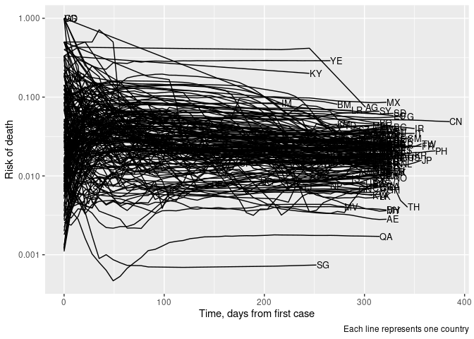
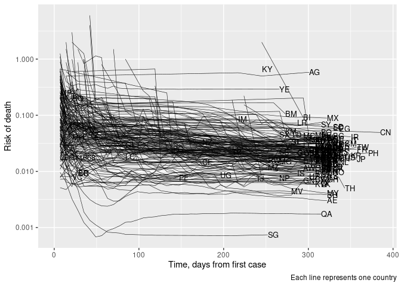

Covid-19 cases
================
rstats-tartu
2020-03-23 14:41:22

Daily covid-19 data is from [European Centre for Disease Prevention and
Control](https://www.ecdc.europa.eu/en/publications-data/download-todays-data-geographic-distribution-covid-19-cases-worldwide).

Loading libraries

``` r
library("dplyr")
library("readxl")
library("lubridate")
library("here")
library("glue")
library("brms")
library("ggplot2")
```

Downloading dataset

``` r
if (!dir.exists(here("data"))) {
  system(glue("mkdir {here('data')}"))
}
yesterday <- Sys.Date() - 1
dataset <- here(glue("data/COVID-19-geographic-disbtribution-worldwide-{yesterday}.xlsx"))
if (!file.exists(dataset)) {
  url <- glue("https://www.ecdc.europa.eu/sites/default/files/documents/COVID-19-geographic-disbtribution-worldwide-{yesterday}.xlsx")
  system(glue("curl -o {dataset} {url}"))
} 
```

Importing downloaded dataset.

``` r
sheet_1 <- excel_sheets(dataset)[1]
covid <- read_excel(dataset, sheet = sheet_1)
covid <- covid %>% 
  rename(Country = `Countries and territories`) %>% 
  rename_all(tolower)
```

Days since first case in each country

``` r
covid <- covid %>% 
  group_by(country, ) %>% 
  mutate(tp = interval(daterep, yesterday) / ddays(1))
```

Number of cases and deaths per country. Keep only informative rows.

``` r
lag_n <- 7
covid <- covid %>% 
  mutate(cum_cases = with_order(tp, cumsum, cases),
         cum_deaths = with_order(tp, cumsum, deaths),
         risk = cum_deaths / cum_cases,
         risk_lag = cum_deaths / lag(cum_cases, n = lag_n, order_by = tp)) %>% 
  ungroup() %>% 
  filter(cases != 0, deaths !=0)
```

``` r
covid %>% 
  ggplot(aes(tp, cum_cases)) +
  geom_line(aes(group = country)) +
  labs(x = "Days since first case in each country", 
       y = "Cumulative number of cases",
       caption = "Each line represents one country")
```

<!-- -->

Number of deaths per country.

``` r
covid %>% 
  ggplot(aes(tp, cum_deaths)) +
  geom_line(aes(group = country)) +
  labs(x = "Days since first death in each country", 
       y = "Cumulative number of deaths",
       caption = "Each line represents one country")
```

<!-- -->

Risk

``` r
covid %>% 
  filter(!is.na(risk)) %>% 
  ggplot(aes(tp, risk)) +
  geom_line(aes(group = country)) +
  labs(x = "Time, days from first case", 
       y = "Risk of death",
       caption = "Each line represents one country")
```

<!-- -->

Lagged (7 days) risk.

``` r
covid %>% 
  filter(!is.na(risk)) %>% 
  ggplot(aes(tp, risk_lag)) +
  geom_line(aes(group = country)) +
  scale_y_log10() +
  labs(x = "Time, days from first case", 
       y = "Risk of death",
       caption = "Each line represents one country")
```

<!-- -->
