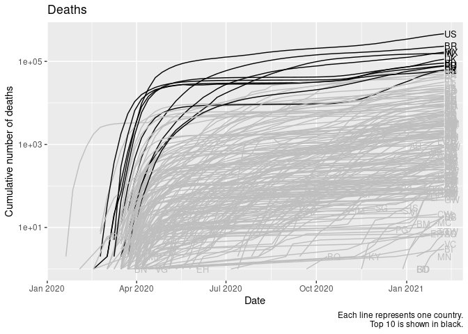

Covid-19 cases
================
rstats-tartu
2020-03-24 07:24:41

Daily covid-19 data is from [European Centre for Disease Prevention and
Control](https://www.ecdc.europa.eu/en/publications-data/download-todays-data-geographic-distribution-covid-19-cases-worldwide).

Loading
libraries

``` r
pkg <- c("dplyr", "tidyr", "readr", "lubridate", "here", "ggplot2", "directlabels")
invisible(lapply(pkg, library, character.only = TRUE))
```

Importing downloaded dataset.

``` r
path <- here("data/COVID-19-geographic-disbtribution-worldwide.csv")
covid <- read_csv(path)
covid <- covid %>% 
  rename(Country = `Countries and territories`) %>% 
  rename_all(tolower)
```

Days since first case in each country

``` r
covid_by_country <- covid %>% 
  filter(cases != 0, deaths != 0) %>% 
  group_by(country) %>% 
  mutate(tp = interval(Sys.Date(), daterep) / ddays(1),
         tp = tp - min(tp))
```

Number of cases and deaths per country. Keep only informative rows.

``` r
lag_n <- 7
covid_cum <- covid_by_country %>% 
  mutate(cum_cases = with_order(tp, cumsum, cases),
         cum_deaths = with_order(tp, cumsum, deaths),
         risk = cum_deaths / cum_cases,
         risk_lag = cum_deaths / lag(cum_cases, n = lag_n, order_by = tp)) %>% 
  ungroup()
```

Covid-19 cases.

``` r
covid_cum %>% 
  ggplot(aes(daterep, cum_cases, group = country)) +
  geom_line() +
  geom_dl(aes(label = geoid), method = list("first.points", cex = 0.8)) +
  scale_y_log10() +
  labs(x = "Date", 
       y = "Cumulative number of cases",
       caption = "Each line represents one country")
```

<!-- -->

Covid-19 deaths.

``` r
covid_cum %>% 
  ggplot(aes(daterep, cum_deaths, group = country)) +
  geom_line() +
  geom_dl(aes(label = geoid), method = list("first.points", cex = 0.8)) +
  scale_y_log10() +
  labs(x = "Date", 
       y = "Cumulative number of deaths",
       caption = "Each line represents one country")
```

<!-- -->

Cases on relative time scale.

``` r
covid_cum %>% 
  ggplot(aes(tp, cum_cases, group = country)) +
  geom_line() +
  geom_dl(aes(label = geoid), method = list("last.points", cex = 0.8)) +
  scale_y_log10() +
  labs(x = "Days since first case in each country", 
       y = "Cumulative number of cases",
       caption = "Each line represents one country")
```

<!-- -->

Number of deaths per country.

``` r
covid_cum %>% 
  ggplot(aes(tp, cum_deaths)) +
  geom_line(aes(group = country)) +
  geom_dl(aes(label = geoid), method = list("last.points", cex = 0.8)) +
  scale_y_log10() +
  labs(x = "Days since first death in each country", 
       y = "Cumulative number of deaths",
       caption = "Each line represents one country")
```

<!-- -->

Risk

``` r
covid_cum %>% 
  ggplot(aes(tp, risk)) +
  geom_line(aes(group = country)) +
  geom_dl(aes(label = geoid), method = list("last.points", cex = 0.8)) +
  scale_y_log10() +
  labs(x = "Time, days from first case", 
       y = "Risk of death",
       caption = "Each line represents one country")
```

<!-- -->

Lagged (7 days) risk.

``` r
covid_cum %>% 
  ggplot(aes(tp, risk_lag)) +
  geom_line(aes(group = country)) +
  geom_dl(aes(label = geoid), method = list("last.points", cex = 0.8)) +
  scale_y_log10() +
  labs(x = "Time, days from first case", 
       y = "Risk of death",
       caption = "Each line represents one country")
```

<!-- -->
