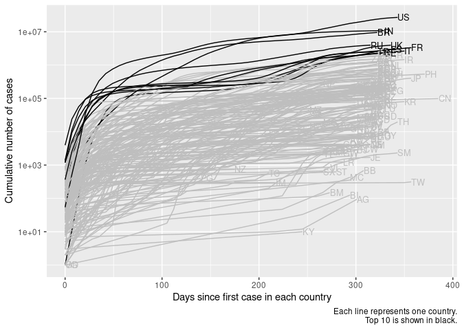

Covid-19 cases
================
rstats-tartu
2020-03-22 16:23:55

Daily covid-19 data is from [European Centre for Disease Prevention and
Control](https://www.ecdc.europa.eu/en/publications-data/download-todays-data-geographic-distribution-covid-19-cases-worldwide).

Loading libraries

``` r
library("dplyr")
library("readxl")
library("lubridate")
library("here")
library("glue")
library("brms")
library("ggplot2")
```

Downloading dataset

``` r
if (!dir.exists(here("data"))) {
  system(glue("mkdir {here('data')}"))
}
yesterday <- Sys.Date() - 1
dataset <- here(glue("data/COVID-19-geographic-disbtribution-worldwide-{yesterday}.xlsx"))
if (!file.exists(dataset)) {
  url <- glue("https://www.ecdc.europa.eu/sites/default/files/documents/COVID-19-geographic-disbtribution-worldwide-{yesterday}.xlsx")
  system(glue("curl -o {dataset} {url}"))
} 
```

Importing downloaded dataset.

``` r
sheet_1 <- excel_sheets(dataset)[1]
covid <- read_excel(dataset, sheet = sheet_1)
covid <- covid %>% 
  rename(Country = `Countries and territories`) %>% 
  rename_all(tolower)
```

Days since first case in each country

``` r
covid <- covid %>% 
  group_by(country) %>% 
  mutate(day = interval(daterep, yesterday) / ddays(1))
```

Number of cases and deaths per country.

``` r
covid <- covid %>% 
  mutate(cum_cases = cumsum(cases),
         cum_deaths = cumsum(deaths)) %>% 
  ungroup()
```

``` r
covid %>% 
  ggplot(aes(day, cum_cases)) +
  geom_line(aes(group = country)) +
  labs(x = "Days since first case in each country", 
       y = "Cumulative number of cases",
       caption = "Each line represents one country")
```

<!-- -->

Number of deaths per country.

``` r
covid %>% 
  ggplot(aes(day, cum_deaths)) +
  geom_line(aes(group = country)) +
  labs(x = "Days since first death in each country", 
       y = "Cumulative number of deaths",
       caption = "Each line represents one country")
```

<!-- -->

Fit dose response model to data.

``` r
# f <- bf(cum_cases ~ plateau * (1 - exp(-k * day)), 
#         plateau ~ 1 + (1 | country), 
#         k ~ 1 + (1 | country), nl = TRUE)
# mod <- brm(f, data = covid, family = gaussian())
```
