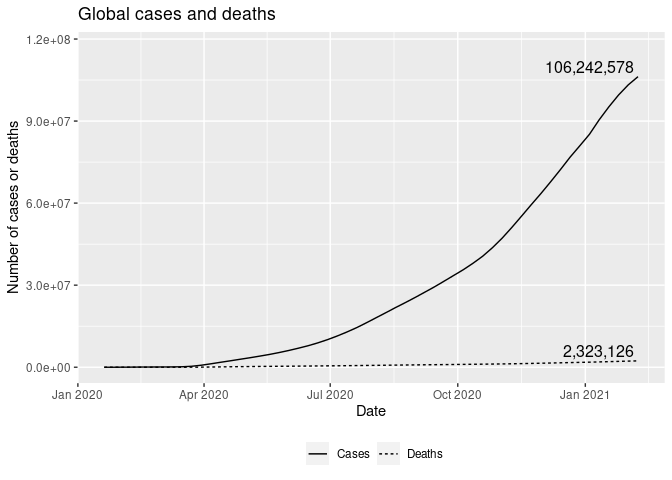
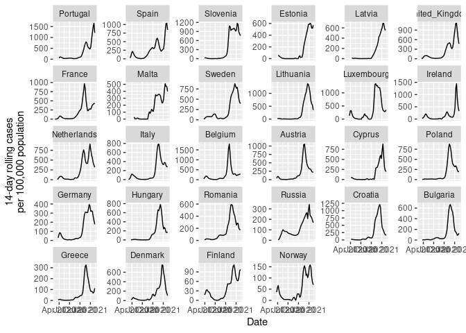
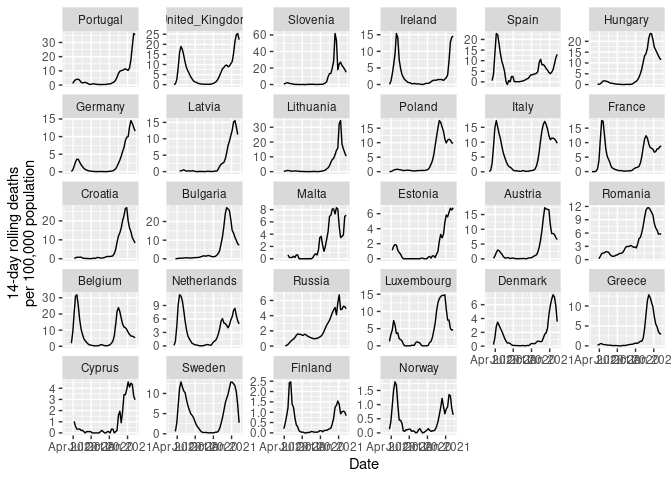
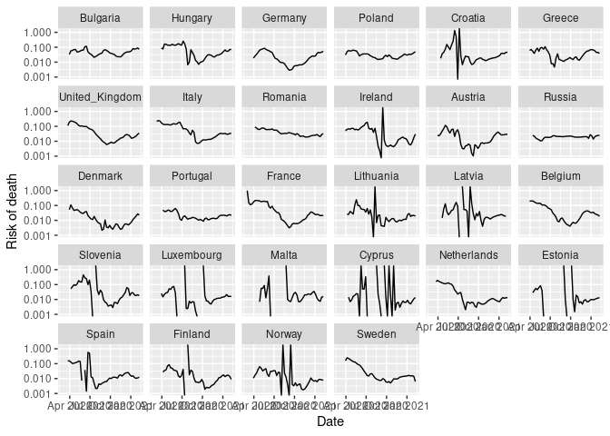
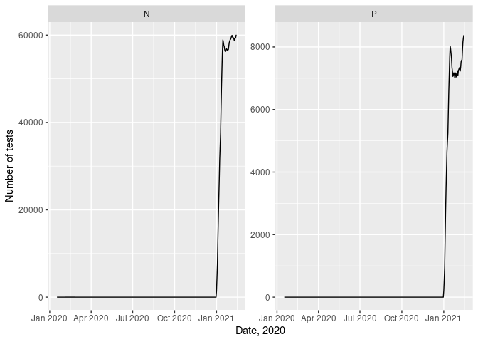
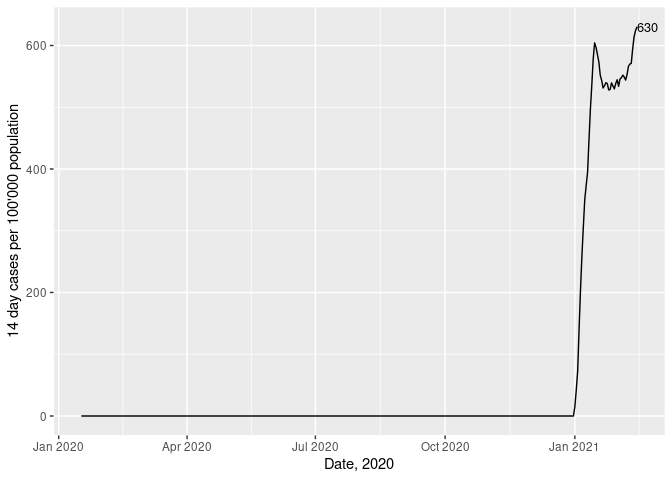
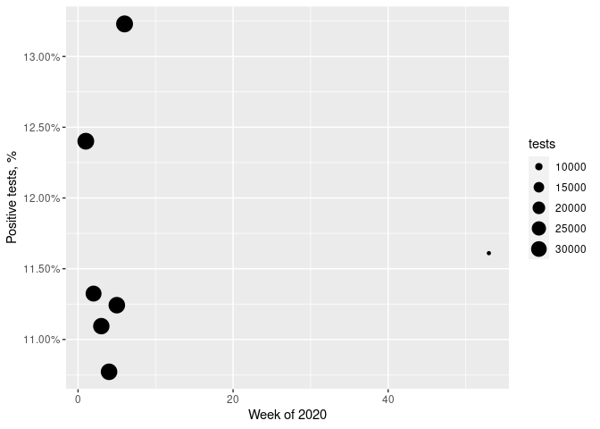
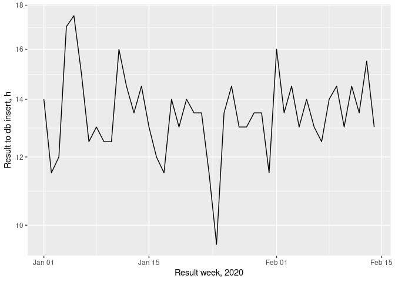
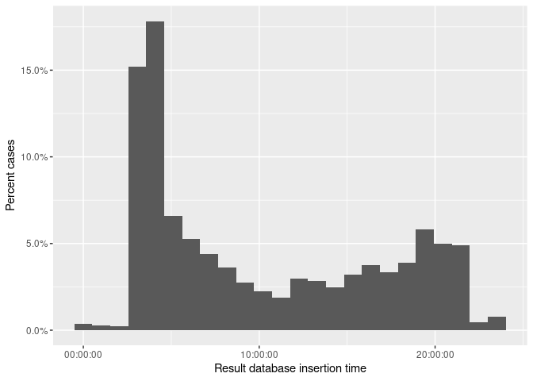
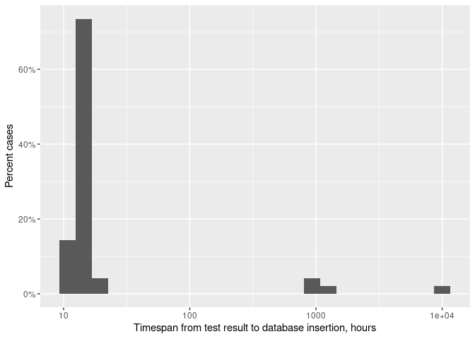

# COVID-19 cases and deaths

rstats-tartu  
last update: 2021-02-05 21:14:18

## Contents

[Dataset](#dataset)  
[Worldwide cases and deaths](#worldwide-cases-and-deaths)  
[Cases and deaths on relative time
scale](#cases-and-deaths-on-relative-time-scale)  
[Risk of death](#risk-of-death)  
[COVID-19 cases in Estonia](#covid-19-cases-in-estonia)  
[Estonian COVID-19 tests handling](#estonian-covid-19-tests-handling)

## Intro

Small selection of graphs illustrating daily developments in COVID-19
epidemic. Code is shown on purpose, in case you want to recreate these
plots.

**Phylogenetic- and geographic distribution of SARS-CoV-2**, COVID-19
causing virus, is available on
<https://auspice.credibleinterval.ee/sarscov2>.

SARS-Cov-2 phylogenetic tree is based solely on sequences published on
NCBI <https://www.ncbi.nlm.nih.gov/genbank/sars-cov-2-seqs/>

## Dataset

Daily COVID-19 worldwide data is from [European Centre for Disease
Prevention and
Control](https://www.ecdc.europa.eu/en/publications-data/download-todays-data-geographic-distribution-covid-19-cases-worldwide).

Estonian COVID-19 dataset was downloaded from Estonian Healthboard
<https://opendata.digilugu.ee/opendata_covid19_test_results.csv>

Datasets were downloaded using [script/get\_data.R](script/get_data.R)
script and saved to `data` folder.

Report was rendered using `rmarkdown::render()` command. To render, you
can run following command from shell:

``` bash
Rscript -e "rmarkdown::render('scripts/main.R', output_format = rmarkdown::github_document(), output_file = 'README.md')"
```

## Setting up data

Loading libraries.

``` r
pkg <- c("dplyr", "tidyr", "readr", "lubridate", "here", "ggplot2", "directlabels", "tibbletime")
invisible(lapply(pkg, library, character.only = TRUE))
eu <- read_csv("https://datahub.io/opendatafortaxjustice/listofeucountries/r/listofeucountries.csv") %>% 
  rename(country = x)
```

Importing downloaded ECDC daily COVID-19 dataset.

``` r
path <- here("data/COVID-19-geographic-distribution-worldwide.csv")
covid <- read_csv(path, col_types = cols(daterep = col_date(format = "%d/%m/%Y")))
```

Resetting timeline to days since first case in each country.

``` r
covid_by_country <- covid %>% 
  rename(cases = casesweekly, deaths = deathsweekly) %>% 
  filter(cases != 0, deaths != 0) %>% 
  group_by(country) %>% 
  mutate(tp = interval(Sys.Date(), daterep) / ddays(1),
         tp = tp - min(tp)
         )
```

Calculating number of cases and deaths per country. Keeping only
informative rows.

``` r
lag_n <- 1
covid_cum <- covid_by_country %>% 
  mutate(cum_cases = with_order(tp, cumsum, cases),
         cum_deaths = with_order(tp, cumsum, deaths),
         risk = cum_deaths / cum_cases,
         risk_lag = cum_deaths / lag(cum_cases, n = lag_n, order_by = tp)) %>% 
  ungroup()
```

## Worldwide cases and deaths

``` r
cumlong <- covid_by_country %>% 
  group_by(daterep) %>% 
  summarise_at(c("cases", "deaths"), sum) %>% 
  mutate_at(c("cases", "deaths"), cumsum) %>% 
  pivot_longer(cases:deaths)
cumlong %>% 
  ggplot(aes(daterep, value, linetype = name)) +
  geom_line() +
  geom_dl(data = cumlong %>% 
            group_by(name) %>% 
            filter(name %in% c("cases", "deaths"), value == max(value)), 
          aes(label = prettyNum(value, big.mark = ",")), 
          method = list("last.points", hjust = 1.05, vjust = -0.3)) +
  labs(x = "Date", 
       y = "Number of cases or deaths",
       title = "Global cases and deaths") +
  scale_y_continuous(limits = c(0, max(cumlong$value) * 1.1)) +
  scale_linetype_discrete(labels = c("Cases", "Deaths")) +
  theme(legend.title = element_blank(),
        legend.position = "bottom")
```

<!-- -->

COVID-19 cases worldwide by country.

``` r
top_10_cases <- covid_cum %>% 
  group_by(country) %>% 
  summarise_at("cum_cases", max) %>% 
  top_n(10, cum_cases) %>% 
  pull(country)
top_10_deaths <- covid_cum %>% 
  group_by(country) %>% 
  summarise_at("cum_deaths", max) %>% 
  top_n(10, cum_deaths) %>% 
  pull(country)


covid_cum %>% 
  ggplot(aes(daterep, cum_cases)) +
  geom_line(aes(group = country, color = country %in% top_10_cases)) +
  geom_dl(aes(label = geoid, color = country %in% top_10_cases), method = list("last.points", cex = 0.8)) +
  scale_y_log10() +
  scale_color_manual(values = c("gray", "black")) +
  theme(legend.position = "none") +
  labs(title = "Cases", 
       x = "Date", 
       y = "Cumulative number of cases",
       caption = "Each line represents one country.\nTop 10 is shown in black.")
```

<!-- -->

COVID-19 deaths worldwide.

``` r
covid_cum %>% 
  ggplot(aes(daterep, cum_deaths)) +
  geom_line(aes(group = country, color = country %in% top_10_deaths)) +
  geom_dl(aes(label = geoid, color = country %in% top_10_deaths), method = list("last.points", cex = 0.8)) +
  scale_y_log10() +
  scale_color_manual(values = c("gray", "black")) +
  theme(legend.position = "none") +
  labs(title = "Deaths", 
       x = "Date", 
       y = "Cumulative number of deaths",
       caption = "Each line represents one country.\nTop 10 is shown in black.")
```

<!-- -->

## Cases and deaths on relative time scale

Number of cases per country.

``` r
covid_cum %>% 
  ggplot(aes(tp, cum_cases)) +
  geom_line(aes(group = country, color = country %in% top_10_cases)) +
  geom_dl(aes(label = geoid, color = country %in% top_10_cases), method = list("last.points", cex = 0.8)) +
  scale_y_log10() +
  scale_color_manual(values = c("gray", "black")) +
  theme(legend.position = "none") +
  labs(x = "Days since first case in each country", 
       y = "Cumulative number of cases",
       caption = "Each line represents one country.\nTop 10 is shown in black.")
```

<!-- -->

Number of deaths per country.

``` r
covid_cum %>% 
  ggplot(aes(tp, cum_deaths)) +
  geom_line(aes(group = country, color = country %in% top_10_deaths)) +
  geom_dl(aes(label = geoid, color = country %in% top_10_deaths), method = list("last.points", cex = 0.8)) +
  scale_y_log10() +
  scale_color_manual(values = c("gray", "black")) +
  theme(legend.position = "none") +
  labs(x = "Days since first death in each country", 
       y = "Cumulative number of deaths",
       caption = "Each line represents one country.\nTop 10 is shown in black.")
```

<!-- -->

## Risk of death

``` r
covid_cum %>% 
  ggplot(aes(tp, risk)) +
  geom_line(aes(group = country)) +
  geom_dl(aes(label = geoid), method = list("last.points", cex = 0.8)) +
  scale_y_log10() +
  labs(x = "Time, days from first case", 
       y = "Risk of death",
       caption = "Each line represents one country")
```

<!-- -->

Lagged (7 days) risk. Risk of death relative to number of cases 7 days
earlier.

``` r
covid_cum %>% 
  ggplot(aes(tp, risk_lag)) +
  geom_line(aes(group = country), size = 0.2) +
  geom_dl(aes(label = geoid), method = list("last.points", cex = 0.8)) +
  scale_y_log10() +
  labs(x = "Time, days from first case", 
       y = "Risk of death",
       caption = "Each line represents one country")
```

<!-- -->

Relative number of cases and deaths per 100,000 population

``` r
rolling_sum <- rollify(sum, window = 2)
```

Fill in missing dates to calculate 14-day rolling sum.

``` r
rolling_sums <- covid_cum %>% 
  group_by(country) %>% 
  complete(daterep = seq.Date(min(daterep), max(daterep), "week"), 
           fill = list(cases = 0, deaths = 0),
           geoid, 
           popdata) %>%
  mutate(nobs = n()) %>% 
  filter(nobs > 14) %>% 
  mutate(cases14 = rolling_sum(cases),
         deaths14 = rolling_sum(deaths),
         cases14_100k = (cases14 / popdata) * 1e5,
         deaths14_100k = (deaths14 / popdata) * 1e5) %>% 
  select(country, daterep, geoid, popdata, ends_with("14"), ends_with("14_100k")) %>% 
  na.omit()
  

europe <- rolling_sums %>% 
  filter(gsub("_", " ", country) %in% c(eu$country, "Norway", "Russia"))

ranks <- europe %>% 
  group_by(country) %>% 
  mutate(
    rank_cases = cases14_100k[daterep == max(daterep)],
    rank_deaths = deaths14_100k[daterep == max(daterep)]) %>% 
  ungroup()

ranks %>% 
  mutate(country = reorder(country, 1 / rank_cases)) %>% 
  ggplot(aes(daterep, cases14_100k)) +
  geom_line(aes(group = country)) +
  facet_wrap(~ country, scales = "free_y") +
  labs(x = "Date", 
       y = "14-day rolling cases\nper 100,000 population")
```

<!-- -->

``` r
ranks %>% 
  mutate(country = reorder(country, 1 / rank_deaths)) %>% 
  ggplot(aes(daterep, deaths14_100k)) +
  geom_line(aes(group = country)) +
  facet_wrap(~ country, scales = "free_y") +
  labs(x = "Date", 
       y = "14-day rolling deaths\nper 100,000 population")
```

<!-- -->

``` r
rolling_sums %>% 
  filter(gsub("_", " ", country) %in% c(eu$country, "Norway", "Russia")) %>% 
  mutate(risk = deaths14 / lag(cases14, 1),
         country = reorder(country, 1 / risk)) %>% 
  group_by(country) %>% 
  mutate(
    rank_risk = risk[daterep == max(daterep)]) %>% 
  ungroup() %>% 
  mutate(country = reorder(country, 1 / rank_risk)) %>% 
  ggplot(aes(daterep, risk)) +
  geom_line(aes(group = country)) +
  facet_wrap(~ country) +
  scale_y_log10() +
  labs(x = "Date", 
       y = "Risk of death")
```

<!-- -->

## COVID-19 cases in Estonia

``` r
est_raw <- read_csv(here("data/opendata_covid19_test_results.csv"))

est <- est_raw %>% 
  mutate(result_wk = isoweek(ResultTime),
         ResultDate = date(ResultTime)) %>% 
  filter(yday(ResultDate) < yday(today()) - 1)
```

2020. aasta rahvaarv Statistikaameti andmebaasist.

<!-- end list -->

``` r
rahvaarv <- 1328976
```

14 day rolling number of cases.

``` r
rolling_sum <- rollify(sum, window = 14)
est_cov_sum <- est %>% 
  count(ResultDate, ResultValue) %>% 
  group_by(ResultValue) %>% 
  complete(ResultDate = seq.Date(min(ResultDate), max(ResultDate), "day"), fill = list(n = 0)) %>%
  group_by(ResultValue) %>% 
  mutate(n14 = rolling_sum(n)) %>% 
  drop_na()

est_cov_sum %>% 
  ggplot() +
  geom_line(aes(ResultDate, n14)) +
  facet_wrap(~ ResultValue, scales = "free_y") +
  labs(x = "Date, 2020",
       y = "Number of tests")
```

<!-- -->

``` r
est_cov_sum_100k <- est_cov_sum %>% 
  filter(ResultValue == "P") %>% 
  mutate(n14_100k = (n14 / rahvaarv) * 100000)

est_cov_sum_100k %>% 
  ggplot(aes(ResultDate, n14_100k)) +
  geom_line() +
  geom_dl(label = prettyNum(est_cov_sum_100k$n14_100k[length(est_cov_sum_100k$n14_100k)], digits = 3), method = list("last.points", cex = 0.8)) +
  labs(x = "Date, 2020",
       y = "14 day cases per 100'000 population")
```

<!-- -->

Percent of positive cases per week.

``` r
est %>% 
  count(result_wk, ResultValue) %>% 
  pivot_wider(names_from = ResultValue, values_from = n) %>% 
  mutate(tests = N + P,
         pp = P / tests) %>% 
  na.omit() %>% 
  ggplot() +
  geom_point(aes(result_wk, pp, size = tests)) +
  scale_y_continuous(labels = scales::percent) +
  labs(x = "Week of 2020",
       y = "Positive tests, %")
```

<!-- -->

## Estonian COVID-19 tests handling

We are looking at the test result reporting and publishing timestamps by
Estonian Healthboard.

When are the analyses performed and reported during the day. Be extra
careful with interpretations\!

``` r
daytime <- function(x) {
  s <- as.character(second(x))
  if (nchar(s) == 1) {
    s <- paste0(s, s)
  }
  paste0(hour(x), ":", minute(x), ":", s) %>% 
    hms::parse_hms()
}

processing <- est %>% 
  mutate(result_to_insert = interval(ResultTime, AnalysisInsertTime) / dhours(1),
         result_time = daytime(ResultTime),
         insert_time = daytime(AnalysisInsertTime)) %>% 
  filter(result_to_insert > 0)  %>% 
  group_by(date(ResultTime)) %>% 
  summarise_at("result_to_insert", median)
```

Results timestamps during day.

``` r
processing %>% 
  filter(`date(ResultTime)` > "2020-03-15") %>% 
  ggplot(aes(`date(ResultTime)`, result_to_insert)) +
  geom_line() +
  scale_y_log10() +
  labs(x = "Result week, 2020", y = "Result to db insert, h")
```

<!-- -->

Timestamps of result insertion to database.

``` r
est %>% 
  mutate(insert_time = daytime(AnalysisInsertTime)) %>% 
  ggplot() +
  geom_histogram(aes(x = insert_time, y = ..count.. / sum(..count..)), bins = 24) +
  scale_y_continuous(labels = scales::percent) +
  labs(x = "Result database insertion time", y = "Percent cases")
```

<!-- -->

Time from test result to database insertion.

``` r
processing %>% 
  ggplot() +
  geom_histogram(aes(x = result_to_insert, y = ..count.. / sum(..count..)), bins = 24) +
  scale_y_continuous(labels = scales::percent) +
  scale_x_log10(labels = formatC) +
  labs(x = "Timespan from test result to database insertion, hours", 
       y = "Percent cases")
```

<!-- -->
